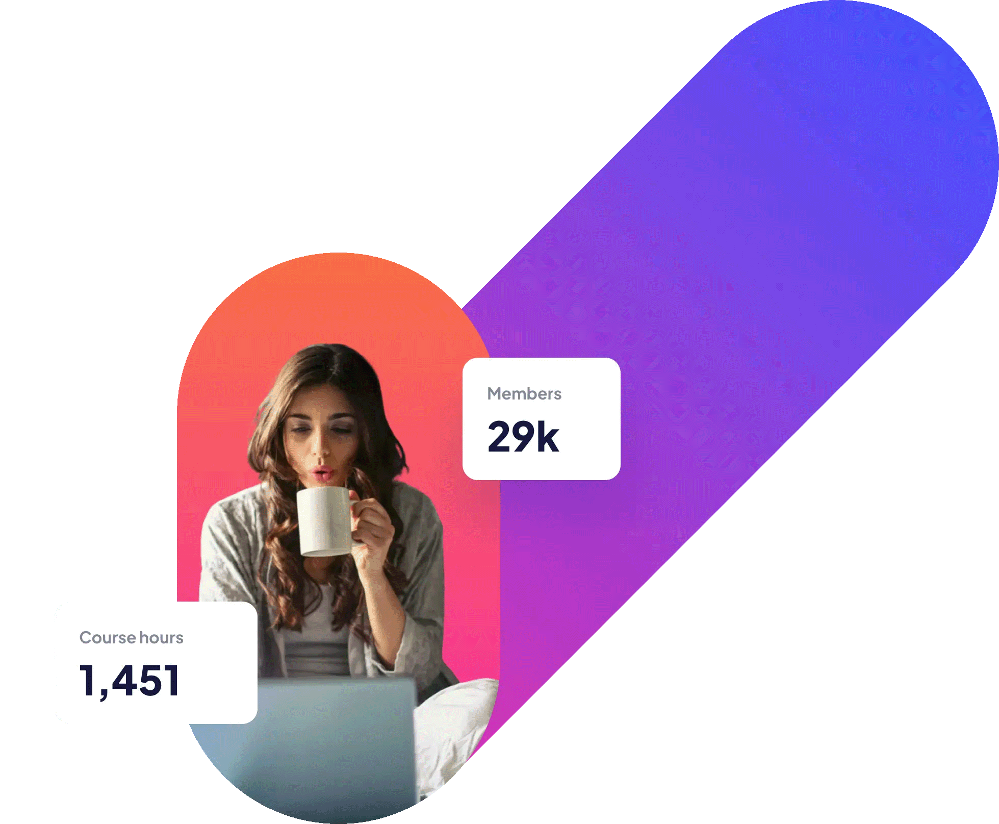

# Frontend Mentor - Skilled e-learning landing page solution

This is a solution to the [Skilled e-learning landing page challenge on Frontend Mentor](https://www.frontendmentor.io/challenges/skilled-elearning-landing-page-S1ObDrZ8q). Frontend Mentor challenges help you improve your coding skills by building realistic projects.

## Table of contents

- [Overview](#overview)
  - [The challenge](#the-challenge)
  - [Screenshot](#screenshot)
  - [Links](#links)
- [My process](#my-process)
  - [Built with](#built-with)
  - [What I learned](#what-i-learned)
  - [Useful resources](#useful-resources)
- [Author](#author)
- [Acknowledgments](#acknowledgments)

## Overview

### The challenge

Users should be able to:

- View the optimal layout depending on their device's screen size
- See hover states for interactive elements

### Screenshot


### Links

- Solution URL: [Github](https://github.com/delroscol98/Skilled-eLearning-Landing-Page)
- Live Site URL: [Github Pages](https://delroscol98.github.io/Skilled-eLearning-Landing-Page/)

## My process

### Built with

- Semantic HTML5 markup
- CSS custom properties
- Flexbox
- CSS Grid
- Mobile-first workflow

### What I learned

This project took me three attempts as I made mistakes using position absolute and relative. Position absolute takes elements out of the original flow and therefore their height and width are not acknowledged by neigbouring elements. Position relative allows elements to be acknowledged by neighbouring elements, however when they are offset from their relative position, the neighbouring elements are not affected by their manipulated position. In order to fix this, I used a combination of margin and padding to move elements and therefore indirectly manipulate neighbouring elements.

The following HTML loads different images based on different viewport widths.

```html
<picture class="hero_img">
  <source
    media="(max-width: 425px)"
    srcset="starter-code/assets/image-hero-mobile@2x.png"
  />
  <source
    media="(max-width: 768px)"
    srcset="starter-code/assets/image-hero-tablet@2x.png"
  />
  <source
    media="(min-width: 1024px)"
    srcset="starter-code/assets/image-hero-desktop@2x.png"
  />
  
</picture>
```

The CSS below is my first time using CSS Grid in a project.

```css
.features {
  width: 89.714vw;
  height: 118.88vw;
  grid-template-columns: 1fr 1fr;
  grid-template-rows: 1fr 1fr 1fr;
  row-gap: 5.6rem;
  column-gap: 1rem;
  margin-top: 12.3rem;
}
```

### Useful resources

- [PX to VW Converter](https://www.quick-tools.net/px-to-vw) - Helped me convert PX to VW to assist in responsive web design.

## Author

- Frontend Mentor - [@delroscol98](https://www.frontendmentor.io/profile/delroscol98)

## Acknowledgments

I'd like to acknowledge [@Laila-front-dev](https://www.frontendmentor.io/profile/Laila-front-dev) for their solutions in mixing gradients to produce hover states.
